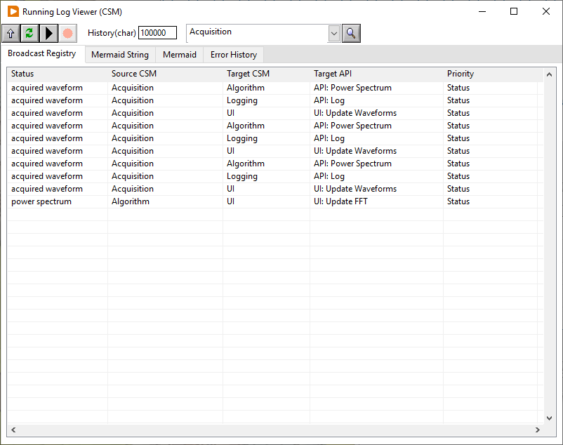
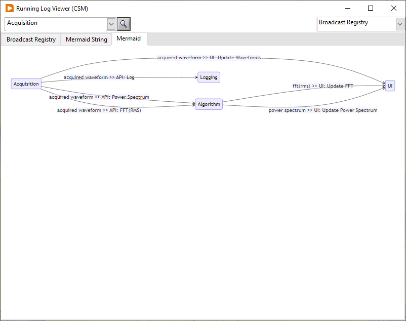

# CSM-Mermaid-Plugin

> [!WARNING]
> 开发中...还未完成

通过 Mermaid 语法绘制 CSM 中的逻辑关系图。目前支持：

1. 显示内部状态(Status)和接口(API)之间的订阅关系。
2. [TODO] JKISM/CSM 模块内部的状态跳转逻辑
3. [TODO] CSM 模块间的调用关系图
4. [TODO] CSM 模块间的状态跳转逻辑图

### 状态(Status)和接口(API)之间的订阅关系

以 [CSM-Continuous-Meausrement-and-Logging](https://github.com/NEVSTOP-LAB/CSM-Continuous-Meausrement-and-Logging) 运行状态(Status)和接口(API)之间的订阅关系为例：

