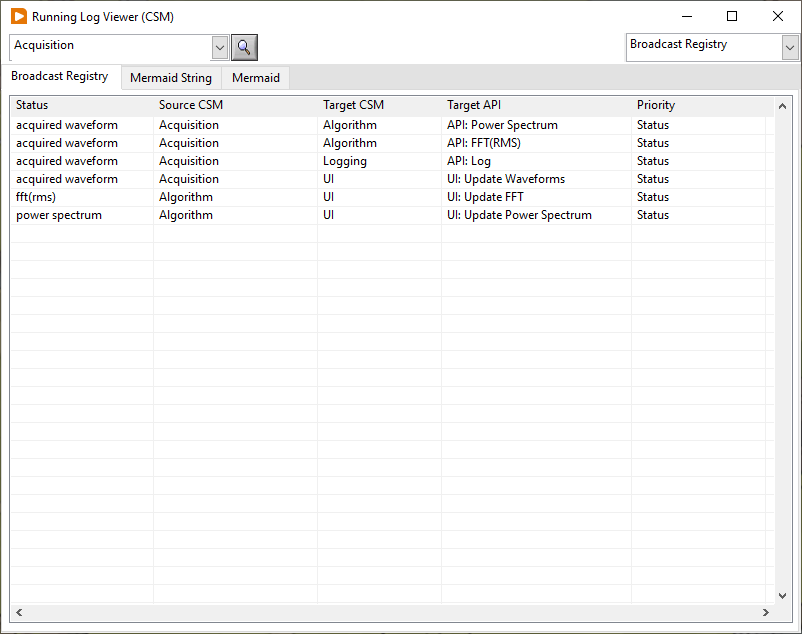

# CSM-Mermaid-Plugin

通过 Mermaid 语法绘制 CSM 中的逻辑关系图。目前支持：

1. 显示内部状态(Status)和接口(API)之间的订阅关系。

### 状态(Status)和接口(API)之间的订阅关系

以 [CSM-Continuous-Meausrement-and-Logging](https://github.com/NEVSTOP-LAB/CSM-Continuous-Meausrement-and-Logging) 运行状态(Status)和接口(API)之间的订阅关系为例：

